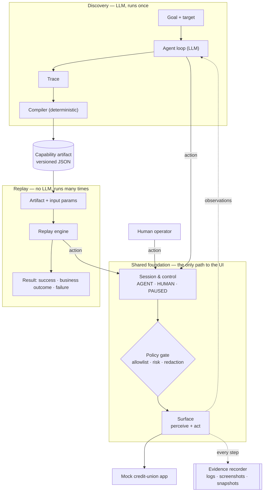

# cua — Computer-Use Automation

A system that lets AI agents operate **legacy back-office applications that have no API** — the
kind of core-banking and servicing screens still common at banks and credit unions.

The core idea:

> **The model discovers. The artifact becomes a reusable capability. Deterministic replay is how
> an agent invokes it in production.**

1. **Discover** — an LLM is given a goal ("look up member 12345 and read their savings balance")
   and drives a real UI to accomplish it.
2. **Record** — the successful run is compiled into a typed, versioned **capability artifact**:
   steps, how each control is located, input parameters, outputs, and success checkpoints.
3. **Replay** — the artifact is re-run with new inputs **without the LLM**, detecting runtime
   errors and returning a structured result.
4. **Escalate** — when automation can't safely proceed, a human takes over the *same* live
   session, then hands control back.
5. **Guard** — every action passes an allowlist/risk policy, and sensitive data is redacted.

> **Status:** early development — Milestones M0–M3 complete (skeleton, mock app, perceive, act).
> See [Roadmap](#roadmap) for progress. Sections marked *(planned)* describe intended design.

---

## Setup

Requires **Python 3.12+** and [uv](https://docs.astral.sh/uv/).

```bash
uv sync                      # creates the environment from uv.lock (dev + mock groups)
uv run python -m pytest -v
```

### Run the mock app

```bash
uv run python -m mock_app --port 5000
```

Open `http://localhost:5000` and sign on as `teller1` / `teller-demo-pass` (fictional operator).
Seeded members: `12345`, `20488`, `31007` — all data in `mock_app/data/` is fictional.

### Perceive a page

With the mock app running, print a page's accessibility snapshot (and optionally save a screenshot):

```bash
uv run python -m cua.surface http://localhost:5000/login --out /tmp/observation
```

### Scripted member lookup (no LLM)

Signs on and opens a member's detail page through the surface, printing the final snapshot:

```bash
CUA_USERNAME=teller1 CUA_PASSWORD=teller-demo-pass uv run python -m cua.scripted 12345
```

Browser tests and the commands above need Chromium. Replit provides one (see below); elsewhere run
`uv run playwright install chromium` once.

Always go through `uv run` rather than activating an environment by hand: it syncs against
`uv.lock` first and uses whichever environment uv manages.

### Configuration

| Variable | Needed from | Purpose |
|---|---|---|
| `CUA_USERNAME`, `CUA_PASSWORD` | M3 | Operator sign-on for the target app. Read from the environment so credentials never appear in code, arguments, or artifacts. |
| `OPENAI_API_KEY` | M4 | LLM access for discovery runs. Never commit it — use env vars / secrets. |

### Replit notes

- `.replit` loads the `python-3.12` module (provides pip and the C++ runtime Playwright needs).
- Replit sets `UV_PROJECT_ENVIRONMENT=.pythonlibs`, so uv installs there instead of `.venv/`;
  `uv run` handles this transparently.
- Replit ships a Playwright-compatible Chromium at `$REPLIT_PLAYWRIGHT_CHROMIUM_EXECUTABLE`, which
  is why Playwright is pinned to `1.55.0`.

---

## Architecture *(planned)*

Two paths — **discovery** (LLM, runs once) and **replay** (deterministic, runs many times) — built
on one shared foundation.



Every actor — the LLM agent, the replay engine, and a human operator — reaches the UI through the
same two checkpoints: **session control** (is it your turn?) and the **policy gate** (is this
allowed?).

| Component | Responsibility |
|---|---|
| **Surface** | `perceive` (accessibility snapshot + screenshot) and `act` (click/type/select). The seam that lets web, legacy web, and desktop surfaces share one flow model. |
| **Policy gate** | Single choke point for every action: allowlist, risk classification, redaction. |
| **Agent loop** | LLM observe → decide → act loop until the goal is met or a stop condition hits. |
| **Compiler** | Turns a recorded trace into a parameterized artifact, deterministically. |
| **Replay engine** | Executes artifacts, verifies checkpoints, classifies errors, returns typed results. |
| **Session & control** | Owns the live session and who controls it (`AGENT` / `HUMAN` / `PAUSED`). |
| **Evidence recorder** | Redacted structured logs and failure snapshots. |
| **Mock app** | Stand-in for a legacy bank application, with deliberately hostile markup. |

### Key decisions so far

| Decision | Choice | Why |
|---|---|---|
| Process model | One Python process (async); mock app as a separate server | The brief rewards simplicity over infrastructure. Boundaries are Python interfaces, so they could become services later. |
| Guardrails | One policy gate for discovery, replay, *and* human actions | A guardrail with a bypass isn't a guardrail — no code path reaches the surface without policy. |
| Artifact origin | LLM produces a **trace**; a deterministic **compiler** produces the artifact | Locators come from real elements, not model-invented selectors, and the artifact is decoupled from the transcript (which may contain sensitive data). |
| Perception | Accessibility tree first, screenshots as supporting evidence | Roles and names survive markup changes and also exist on desktop platforms. Unlabeled legacy controls will need fallback locators (M16). |
| Target app | Local mock credit-union app (Flask, server-rendered) | Legal, no real PII, and lets us inject failures (not found, timeouts, dialogs) on demand. It's a separate process standing in for vendor software, so its framework is independent of `cua`. |
| Snapshot format | Playwright's ARIA snapshot (YAML-like text) of `body` | Compact, readable by both humans and LLMs, and the format Playwright maintains (the older `page.accessibility` API is deprecated). Legacy layout tables make it noisy — outer rows repeat the whole page's text — which matters for token budgets in M4. |
| Element targeting | Role + **exact** accessible name (`button "Search"`); zero or several matches is an error | Targets use the same names the LLM sees in the snapshot. Never "first match": on the mock app, the first submit button after sign-on is *Log Off*, so guessing silently logs the operator out. |
| Mock data | JSON seed files → in-memory store with reset | Stable known values for replay assertions; PII-shaped but obviously fictional data to exercise redaction; resettable after mutating flows. |

---

## Tech stack

| Area | Choice | Why |
|---|---|---|
| Language | Python 3.12 | Readable for reviewers; Pydantic suits the typed artifact schema. |
| Browser automation | Playwright (async) | Reliable waiting, accessibility snapshots, and async fits the live-handoff model. |
| LLM | OpenAI (model chosen in M4) | Available API access; structured outputs for typed actions. |
| Packaging | `pyproject.toml` + uv (`uv.lock`) | Reproducible, locked installs with one fast command; dev/mock deps are dependency groups since they aren't part of `cua` itself. |
| Tests | pytest | Standard and minimal. |

Dependencies are added in the milestone that first needs them, so each commit shows why.

---

## Roadmap

Built in small, runnable, individually committed milestones.

**Phase A — Foundations**
- [x] **M0** Project skeleton: `pyproject.toml`, `src/` layout, file-length test
- [x] **M1** Mock app v1: login → member search → member detail (Flask, JSON seed data)
- [x] **M2** Surface (perceive): accessibility snapshot + screenshot of the mock app
- [x] **M3** Surface (act): scripted search for a member, no LLM

**Phase B — The LLM discovers**
- [ ] **M4** Single LLM step: goal + snapshot → one structured action
- [ ] **M5** Agent loop: first real discovery run
- [ ] **M6** Evidence: structured step log, screenshots, redaction

**Phase C — Capabilities & replay**
- [ ] **M7** Artifact schema v1, hand-written for the member-lookup flow
- [ ] **M8** Replay v1: execute the hand-written artifact
- [ ] **M9** Compiler: trace → artifact (first full discover → replay thread)
- [ ] **M10** Typed parameters and outputs (`member_id` in, `balance` out)

**Phase D — Real-world errors**
- [ ] **M11** Mock app failure modes: not found, validation, dialogs, slowness, session timeout
- [ ] **M12** Replay error taxonomy: business outcome vs. recoverable vs. hard failure

**Phase E — Safety & humans**
- [ ] **M13** Policy gate: allowlist and risky-action handling
- [ ] **M14** Control state, pause/resume, intervention requests
- [ ] **M15** Minimal operator console for live-session takeover

**Phase F — Legacy reality & submission**
- [ ] **M16** Hostile markup (unlabeled fields, frames) and locator fallbacks
- [ ] **M17** Final evidence runs, `REPORT.md`

---

## Repository layout

```
├── pyproject.toml     project metadata, dependencies, tool config
├── uv.lock            locked dependency versions (commit it; update with `uv lock`)
├── src/cua/           the automation system (our product)
│   ├── surface/       perceive and act on a UI — actions, targets, Playwright web surface
│   └── scripted.py    hand-written member lookup (no LLM); replaced by artifacts in M7
├── mock_app/          stand-in legacy bank app (Flask) — deliberately separate from src/
│   └── data/          fictional seed data (JSON)
├── tests/             pytest suite
└── evidence/          discovery & replay run logs and artifacts                     (M5+)
```

## Conventions

- **No source file over 200 lines** — enforced by `tests/test_file_length.py`.
- **One concern per module**; split before a file grows large.
- **Secrets never enter the repo**, artifacts, or logs.
