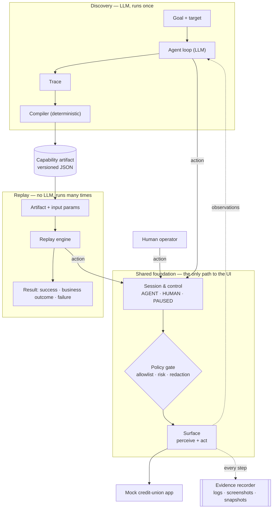

# cua — Computer-Use Automation

A system that lets AI agents operate **legacy back-office applications that have no API** — the
kind of core-banking and servicing screens still common at banks and credit unions.

The core idea:

> **The model discovers. The artifact becomes a reusable capability. Deterministic replay is how
> an agent invokes it in production.**

1. **Discover** — an LLM is given a goal ("look up member 12345 and read their savings balance")
   and drives a real UI to accomplish it.
2. **Record** — the successful run is compiled into a typed, versioned **capability artifact**:
   steps, how each control is located, input parameters, outputs, and success checkpoints.
3. **Replay** — the artifact is re-run with new inputs **without the LLM**, detecting runtime
   errors and returning a structured result.
4. **Escalate** — when automation can't safely proceed, a human takes over the *same* live
   session, then hands control back.
5. **Guard** — every action passes an allowlist/risk policy, and sensitive data is redacted.

> **Status:** early development — Milestone M0 (project skeleton) complete.
> See [Roadmap](#roadmap) for progress. Sections marked *(planned)* describe intended design.

---

## Setup

Requires **Python 3.12+**.

```bash
python3 -m venv .venv
.venv/bin/pip install -e ".[dev]"
.venv/bin/python -m pytest -v
```

Use `.venv/bin/python -m pytest` rather than `.venv/bin/pytest`: invoking the interpreter directly
guarantees the virtual environment's packages are used.

### Configuration

| Variable | Needed from | Purpose |
|---|---|---|
| `OPENAI_API_KEY` | M4 | LLM access for discovery runs. Never commit it — use env vars / secrets. |

### Replit notes

- `.replit` loads the `python-3.12` module (provides pip and the C++ runtime Playwright needs).
- Replit's pip config forces user installs; inside a venv, prefix installs with `PIP_USER=0`.
- Replit ships a Playwright-compatible Chromium at `$REPLIT_PLAYWRIGHT_CHROMIUM_EXECUTABLE`, which
  is why Playwright is pinned to `1.55.0`.

---

## Architecture *(planned)*

Two paths — **discovery** (LLM, runs once) and **replay** (deterministic, runs many times) — built
on one shared foundation.



Every actor — the LLM agent, the replay engine, and a human operator — reaches the UI through the
same two checkpoints: **session control** (is it your turn?) and the **policy gate** (is this
allowed?).

| Component | Responsibility |
|---|---|
| **Surface** | `perceive` (accessibility snapshot + screenshot) and `act` (click/type/select). The seam that lets web, legacy web, and desktop surfaces share one flow model. |
| **Policy gate** | Single choke point for every action: allowlist, risk classification, redaction. |
| **Agent loop** | LLM observe → decide → act loop until the goal is met or a stop condition hits. |
| **Compiler** | Turns a recorded trace into a parameterized artifact, deterministically. |
| **Replay engine** | Executes artifacts, verifies checkpoints, classifies errors, returns typed results. |
| **Session & control** | Owns the live session and who controls it (`AGENT` / `HUMAN` / `PAUSED`). |
| **Evidence recorder** | Redacted structured logs and failure snapshots. |
| **Mock app** | Stand-in for a legacy bank application, with deliberately hostile markup. |

### Key decisions so far

| Decision | Choice | Why |
|---|---|---|
| Process model | One Python process (async); mock app as a separate server | The brief rewards simplicity over infrastructure. Boundaries are Python interfaces, so they could become services later. |
| Guardrails | One policy gate for discovery, replay, *and* human actions | A guardrail with a bypass isn't a guardrail — no code path reaches the surface without policy. |
| Artifact origin | LLM produces a **trace**; a deterministic **compiler** produces the artifact | Locators come from real elements, not model-invented selectors, and the artifact is decoupled from the transcript (which may contain sensitive data). |
| Perception | Accessibility tree first, screenshots as supporting evidence | Roles and names survive markup changes and also exist on desktop platforms. Unlabeled legacy controls will need fallback locators (M16). |
| Target app | Local mock credit-union app | Legal, no real PII, and lets us inject failures (not found, timeouts, dialogs) on demand. |

---

## Tech stack

| Area | Choice | Why |
|---|---|---|
| Language | Python 3.12 | Readable for reviewers; Pydantic suits the typed artifact schema. |
| Browser automation | Playwright (async) | Reliable waiting, accessibility snapshots, and async fits the live-handoff model. |
| LLM | OpenAI (model chosen in M4) | Available API access; structured outputs for typed actions. |
| Packaging | `pyproject.toml` + pip | Modern Python standard; no extra tooling for reviewers. |
| Tests | pytest | Standard and minimal. |

Dependencies are added in the milestone that first needs them, so each commit shows why.

---

## Roadmap

Built in small, runnable, individually committed milestones.

**Phase A — Foundations**
- [x] **M0** Project skeleton: `pyproject.toml`, `src/` layout, file-length test
- [ ] **M1** Mock app v1: member search → member detail (happy path)
- [ ] **M2** Surface (perceive): accessibility snapshot + screenshot of the mock app
- [ ] **M3** Surface (act): scripted search for a member, no LLM

**Phase B — The LLM discovers**
- [ ] **M4** Single LLM step: goal + snapshot → one structured action
- [ ] **M5** Agent loop: first real discovery run
- [ ] **M6** Evidence: structured step log, screenshots, redaction

**Phase C — Capabilities & replay**
- [ ] **M7** Artifact schema v1, hand-written for the member-lookup flow
- [ ] **M8** Replay v1: execute the hand-written artifact
- [ ] **M9** Compiler: trace → artifact (first full discover → replay thread)
- [ ] **M10** Typed parameters and outputs (`member_id` in, `balance` out)

**Phase D — Real-world errors**
- [ ] **M11** Mock app failure modes: not found, validation, dialogs, slowness, session timeout
- [ ] **M12** Replay error taxonomy: business outcome vs. recoverable vs. hard failure

**Phase E — Safety & humans**
- [ ] **M13** Policy gate: allowlist and risky-action handling
- [ ] **M14** Control state, pause/resume, intervention requests
- [ ] **M15** Minimal operator console for live-session takeover

**Phase F — Legacy reality & submission**
- [ ] **M16** Hostile markup (unlabeled fields, frames) and locator fallbacks
- [ ] **M17** Final evidence runs, `REPORT.md`

---

## Repository layout

```
├── pyproject.toml     project metadata, dependencies, tool config
├── src/cua/           the automation system (our product)
├── mock_app/          stand-in legacy bank app — deliberately separate from src/   (M1)
├── tests/             pytest suite
└── evidence/          discovery & replay run logs and artifacts                     (M5+)
```

## Conventions

- **No source file over 200 lines** — enforced by `tests/test_file_length.py`.
- **One concern per module**; split before a file grows large.
- **Secrets never enter the repo**, artifacts, or logs.
